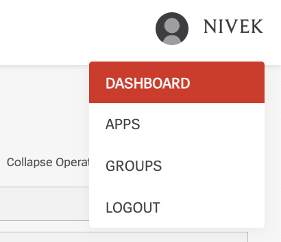
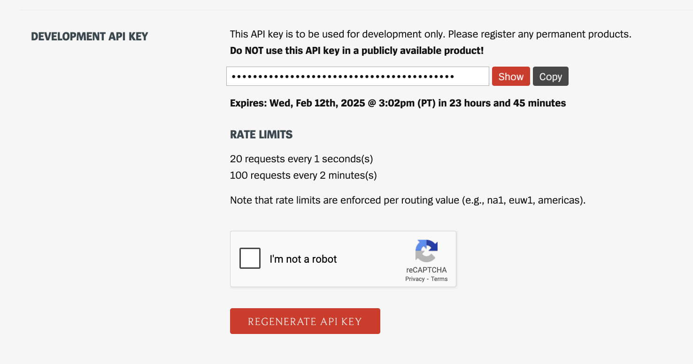

# League Insights Hub

Welcome to the League Insights Hub! This is a full-stack application leveraging React, Bootstrap, Node.js, and PostgreSQL. League Insights is a comprehensive League of Legends dashboard using the Riot Developer API that allows users
to query detailed player statistics for over 180 million users. Notable features include include Player Level, Rank, Win/Loss Ratio, Champion Mastery, and Player Match History. Follow the steps below to get started:

## Installation

Download the following dependencies.

### Backend

```python
cd backend

npm init -y
npm i -g concurrently
npm i express cors pg
npm i --save-dev nodemon
npm i -D jest supertest
```

### Frontend

```python
cd frontend

npm install react-bootstrap bootstrap react-router-dom
```

### PostgreSQL Set-Up

League Insights Hub utilizes PostgreSQL for persistent data storage. To configure your PostgreSQL database, follow the instructions below:

1. Download PostgreSQL at https://www.postgresql.org/download/.
2. Open the PostgreSQL Shell.
3. Enter your login and password credentials (configured during your installation in Step #1) in the Shell terminal. Your Shell should look as follows:


4. Create your league database using the following command:

```python
CREATE DATABASE league;
```

5. Connect to your newly create league database using:

```python
\c league
```

6. Create your PostgreSQL table for your league database by typing in:

```python
CREATE TABLE summonerData (
    id SERIAL PRIMARY KEY,
    summonerName VARCHAR(50),
    summonerTagline VARCHAR(50),
    summonerMetaData JSONB
);
```

7. Congrats, you have now created your league database to store your queries!

## Riot Developer API Key

This project utilizes the Riot Developer API to query for summoner metadata. To generate your API key, follow the instructions below:

1. Navigate to https://developer.riotgames.com/apis and create an account.
2. Once you have created your account, click on your name in the top right corner to trigger the drop-down menu.



3. Click on dashboard.
4. Locate "Development API key" and generate your API key.



## Config

The following configuration files are required in order to setup the Database and API-key. Follow the instructions below to configure your PostgreSQL and API-key.

1. First, change directories into the backend folder.

```python
cd backend
```

2. Create a config folder (/backend/config) within the backend directory.

```python
mkdir config
```

3. Change directories into the config folder.

```python
cd config
```

3. Create a Config.js file (/backend/config/Config.js) within your config folder containing:

```python
module.exports = {
  api_key: "your API-key",
};
```

4. Create a Database.js file (/backend/config/Database.js) within your config folder containing:

```python
const Pool = require("pg").Pool;

const pool = new Pool({
  user: "postgres",
  password: "your password (created during initial PostgreSQL installation)",
  host: "localhost",
  port: 5432,
  database: "league",
});

module.exports = pool;
```

## Usage

To run the application, change directory to the root folder and type:

```python
npm run dev
```

## Features

League Insights can query for Summoner Information, Ranked Performance, Summoner Status, Summoner Top Champions, and Summoner Match History. Additional miscellaneous features include client-side caching to reduce API call latency and Unit Testing (Jest).

### 1. Landing Page


### 2. Search Inputs


### 3. Summoner Information, Ranked Performance, and Status


### 4. Top Played Champions


### 5. Match Histories (Paginated)


<br/>
<br/>


### 6. Query-Caching

```
Utilized PostgreSQL for query caching, improving data retrieval speeds and reducing API call latency from ~5000 ms
to 15 ms, achieving a > 99% performance improvement
```


### 7. Unit Tests (Jest)


