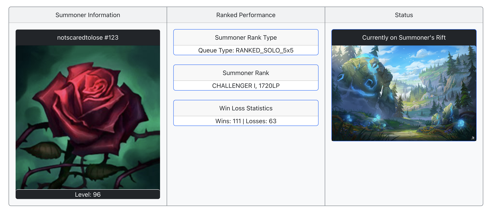
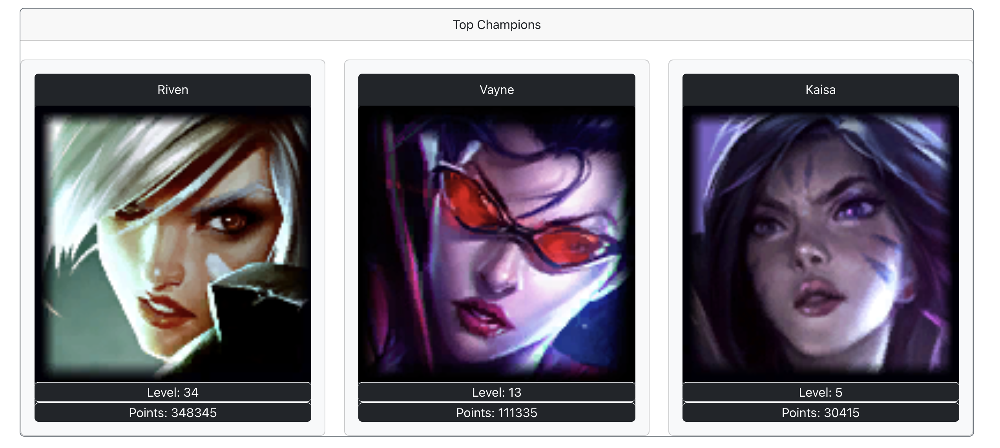
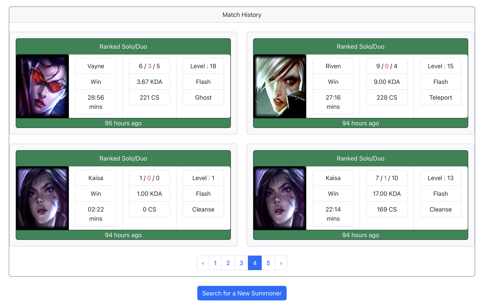
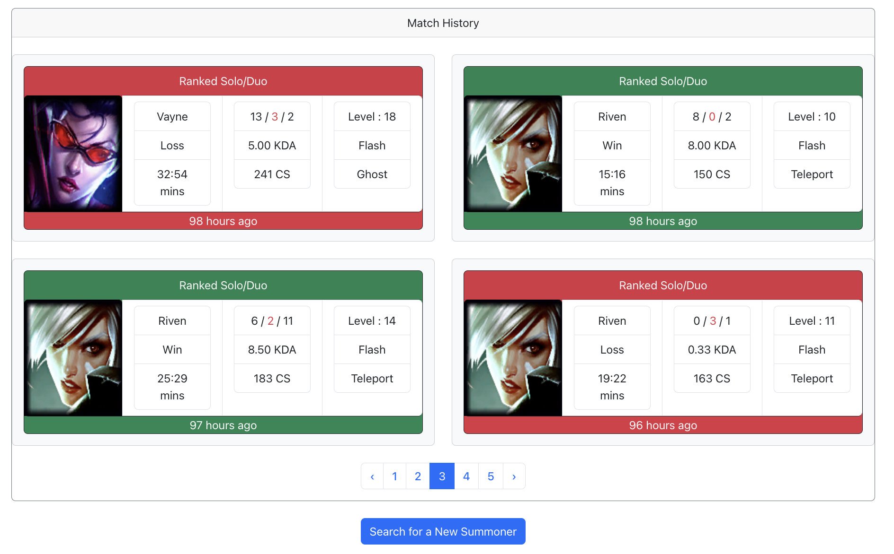
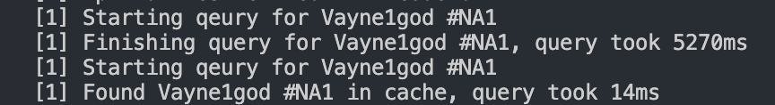
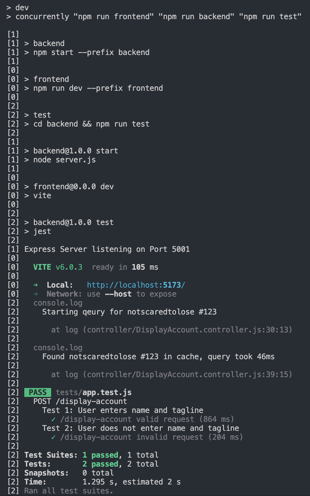

# League Insights Hub

Welcome to the League Insights Hub! This is a full-stack application leveraging React, Bootstrap, Node.js, and PostgreSQL. League Insights is a comprehensive League of Legends dashboard using the Riot Developer API that allows users
to query detailed player statistics for over 180 million users. Notable features include include Player Level, Rank, Win/Loss Ratio, Champion Mastery, and Player Match History. Follow the steps below to get started:

## Installation

Download the following dependencies.

### Backend

```python
cd backend

npm init -y
npm i -g concurrently
npm i express cors pg
npm i --save-dev nodemon
npm i -D jest supertest
```

### Frontend

```python
cd frontend

npm install react-bootstrap bootstrap react-router-dom
```

### Config

The following configuration files are required in order to setup the Database and API-key.

```python
cd backend
```

1. Create a config folder.
2. cd config.
3. Create a Config.js file containing:

```python
module.exports = {
  api_key: "RGAPI-9ef04f8a-3206-4a2d-9885-25ae7f38f4f2",
};
```

4. Create a Database.js file containing:

```python
const Pool = require("pg").Pool;

const pool = new Pool({
  user: "your user name",
  password: "your password",
  host: "your host",
  port: your port,
  database: "your database",
});

module.exports = pool;
```

## Usage

To run the application, change directory to the root folder and type:

```python
npm run dev
```

## Features

League Insights can query for Summoner Information, Ranked Performance, Summoner Status, Summoner Top Champions, and Summoner Match History. Additional miscellaneous features include client-side caching to reduce API call latency and Unit Testing (Jest).

### 1. Landing Page


### 2. Search Inputs


### 3. Summoner Information, Ranked Performance, and Status



### 4. Top Played Champions



### 5. Match Histories (Paginated)


<br/>
<br/>


### 6. Query-Caching

```
Utilized PostgreSQL for query caching, improving data retrieval speeds and reducing API call latency from ~5000 ms
to 15 ms, achieving a > 99% performance improvement
```



### 7. Unit Tests (Jest)


