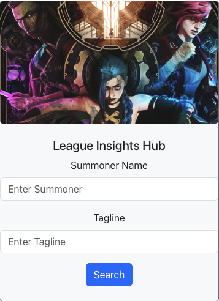
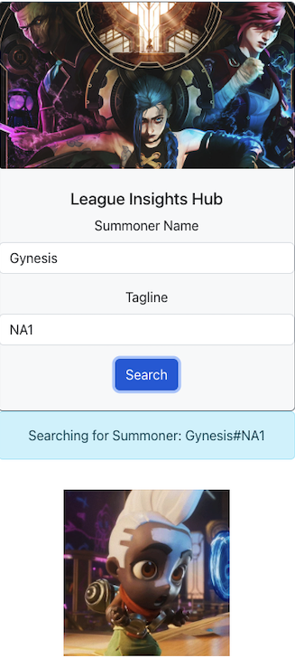
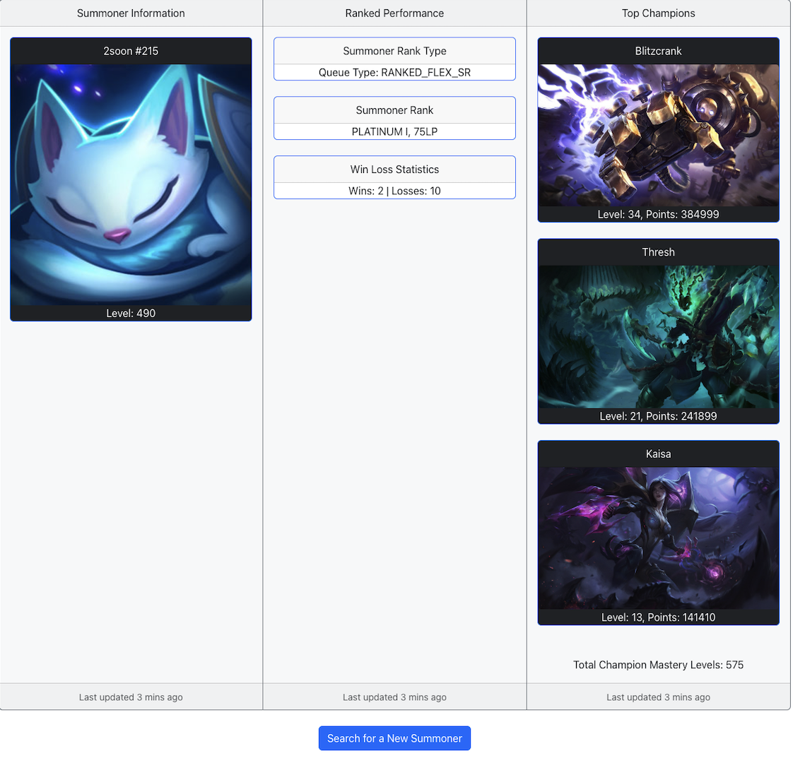

# League Insights Hub

Welcome to the League Insights Hub! This is a full-stack application leveraging React, Bootstrap, Node.js, and PostgreSQL. League Insights is a comprehensive League of Legends dashboard using the Riot Developer API that allows users
to query detailed player statistics for over 180 million users. Metrics include Player Level, Rank, Win/Loss Ratio, Champion Mastery, and more. Follow the steps below to get started:

1. Image Demo:
<ul>
  <li>
    
    
Home Page

  </li>
  <li>
    
    
Search Page

  </li>
  <li>
    
    
Profile Page

  </li>
</ul>

2. Download dependencies first: 

   - cd backend 
   - npm init -y 
   - npm i express cors pg 
   - npm install --save-dev nodemon  

   - cd frontend 
   - npm install react-bootstrap bootstrap react-router-dom 

3. To run the server: 
   - cd frontend > npm run dev
   - cd backend > npm run dev
